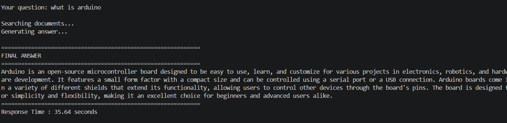
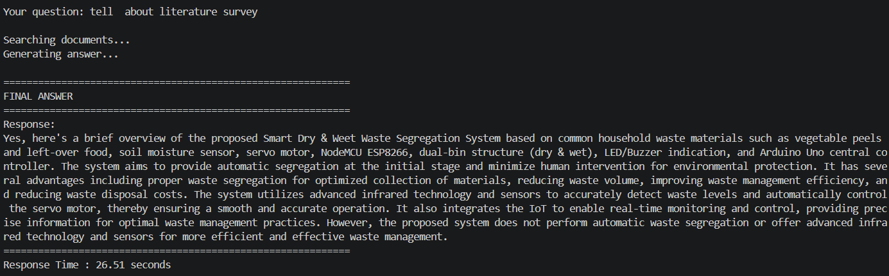
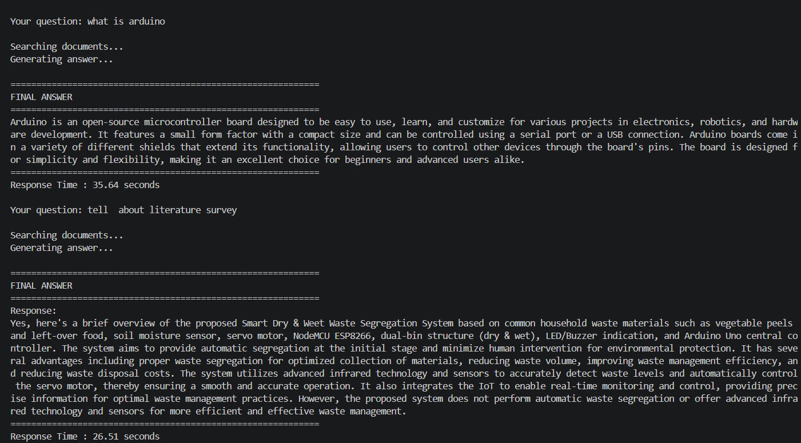

# 📚 Local RAG Application using FAISS + Ollama

A **Retrieval-Augmented Generation (RAG)** application that enables users to ask questions about their own **PDF** and **TXT** documents using **Sentence Transformers**, **FAISS**, and a **local Ollama Large Language Model (LLM)**.

Unlike cloud-based AI applications, this project runs entirely on your local machine, ensuring **privacy**, **offline access**, and **fast document retrieval**.

---

## 🚀 Features

- 📄 Supports PDF and TXT documents
- 🧠 Semantic embeddings using **Sentence Transformers (all-MiniLM-L6-v2)**
- 🔍 Fast semantic search with **FAISS**
- 🤖 Local LLM using **Ollama (TinyLlama / Llama3.2)**
- 💾 Automatic embedding caching
- ⚡ Automatic FAISS index caching
- 🔒 Fully offline after downloading the model
- 📚 Retrieval-Augmented Generation (RAG)
- 🐍 Simple and beginner-friendly Python implementation

---

## 🛠️ Technologies Used

- Python
- Ollama
- FAISS
- Sentence Transformers
- NumPy
- PyPDF

---

## 📂 Project Structure

```text
local-rag-app/
│
├── documents/
│   └── Place your PDF/TXT files here
│
├── images/
│   ├── demo1.png
│   ├── demo2.png
│   └── demo3.png
│
├── rag_app.py
├── requirements.txt
├── README.md
└── .gitignore
```

---

## ⚙️ Installation

### 1. Clone the Repository

```bash
git clone https://github.com/trivenibiradar22/local-rag-app.git

cd local-rag-app
```

---

### 2. Create a Virtual Environment

### Windows

```bash
python -m venv venv

venv\Scripts\activate
```

### Linux / macOS

```bash
python3 -m venv venv

source venv/bin/activate
```

---

### 3. Install Dependencies

```bash
pip install -r requirements.txt
```

---

### 4. Install Ollama

Download Ollama:

https://ollama.com/download

---

### 5. Download an LLM

For systems with lower RAM:

```bash
ollama pull tinyllama
```

For better answer quality:

```bash
ollama pull llama3.2
```

---

## ▶️ Running the Application

1. Place your PDF or TXT documents inside the **documents** folder.

2. Run the application:

```bash
python rag_app.py
```

3. Ask questions about your documents.

Example:

```text
Your question:
What is Arduino?
```

---

## 📸 Demo

### Application Startup



---

### Asking a Question



---

### Generated Answer



---

## 💬 Example

**Question**

```text
What is Arduino?
```

**Answer**

```text
Arduino is an open-source microcontroller board used as the central controller in the Smart Dry and Wet Waste Segregation System.
```

---

## 🧠 How It Works

1. Load PDF and TXT documents.
2. Split documents into smaller chunks.
3. Generate embeddings using Sentence Transformers.
4. Store embeddings inside a FAISS vector index.
5. Retrieve the most relevant document chunks.
6. Send the retrieved context to Ollama.
7. Generate an answer using only the retrieved information.

---

## 📦 Dependencies

Install all dependencies using:

```bash
pip install -r requirements.txt
```

Main libraries:

- faiss-cpu
- sentence-transformers
- ollama
- numpy
- pypdf

---

## 🔮 Future Improvements

- 🌐 Streamlit Web Interface
- 📁 Upload multiple documents
- 📄 DOCX support
- 💬 Chat history
- 🧠 Conversation memory
- 📌 Source citations with page numbers
- ⚡ Incremental indexing
- 🔍 Hybrid Search (BM25 + FAISS)

---

## 👨‍💻 Author

**Triveni Biradar**

B.Tech – Electronics & Telecommunication Engineering

MIT Academy of Engineering (MITAOE), Pune

GitHub: https://github.com/trivenibiradar22

---

## 🤝 Contributing

Contributions are welcome.

1. Fork the repository.
2. Create a new feature branch.
3. Commit your changes.
4. Push the branch.
5. Open a Pull Request.

---

## ⭐ Support

If you found this project useful, please consider giving it a ⭐ on GitHub.

It helps others discover the project and motivates future improvements.

---

## 📜 License

This project is licensed under the **MIT License**.
